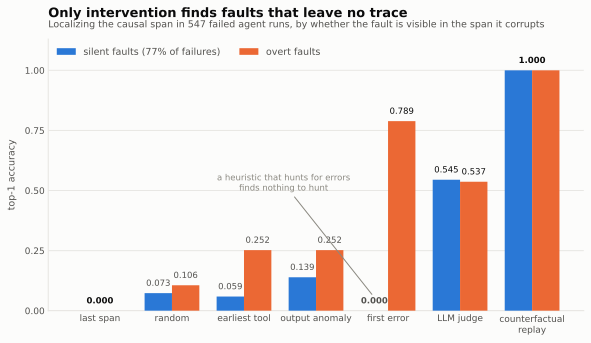
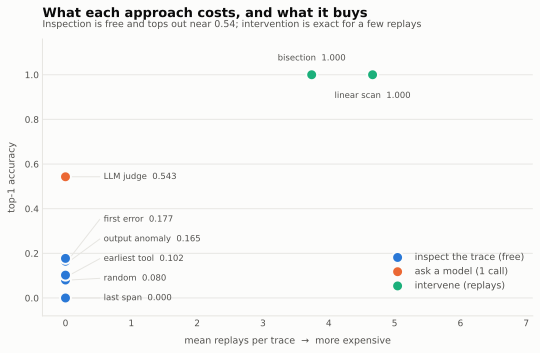
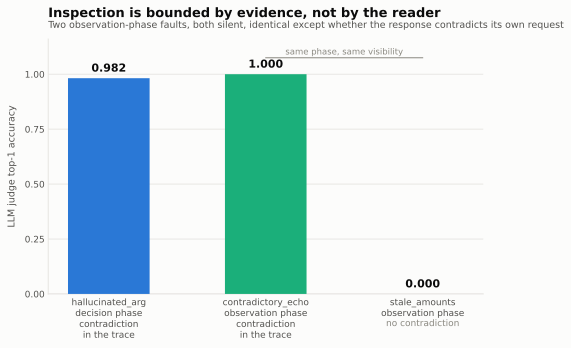
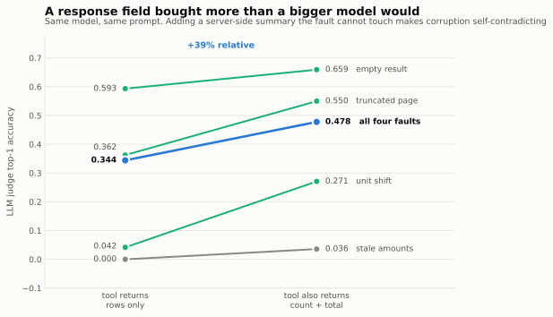

# Cookbook: finding which step broke your agent

**A walkthrough of building root-cause localization for agent failures, and
evaluating it with Phoenix datasets and experiments.**

Your agent answered a question wrong. You open the trace in Phoenix and see
twelve spans, all green, none obviously broken. Somewhere in there a tool
returned a plausible-looking number that was wrong, and everything after it
inherited the mistake.

This is a walkthrough of building something that finds that span, and — more
usefully — of finding out what the cheap approaches can and cannot do. Roughly
an hour end to end. Every number quoted is reproducible from this repo.

**What you'll come away with:**

- Why "look at the trace and find the broken span" fails on most real failures
- A concrete instrumentation change that makes an LLM judge ~39% better without
  changing the model
- How to turn a debugging heuristic into a Phoenix dataset + experiment so you
  can actually compare approaches
- Five mistakes I made that cost real time and money

---

## Setup

```bash
git clone https://github.com/Lkumar209/culprit-agent-rca && cd culprit-agent-rca
python -m venv .venv && source .venv/bin/activate
pip install -e ".[server,judges,dev]"
phoenix serve     # http://localhost:6006
```

The LLM-judge sections need `ANTHROPIC_API_KEY` in `.env`. Everything else runs
with no key and no spend.

---

## Step 1: An agent that fails the way real agents fail

You cannot evaluate a debugging tool without failures you understand. So the
first job is an agent whose mistakes you can *cause on purpose*.

The agent here answers multi-hop questions over a synthetic business domain —
*"What did the vendor behind order ORD-4428 invoice in Q4?"* — by chaining tool
calls: `find_order` → `list_invoices` (paginated) → `sum_amounts`.

**The one property that matters:** the agent must derive every action from what
it *observed*, never from a script.

```python
# culprit/agent.py — the policy reads observations, it does not follow a plan
if "find_order" not in by_tool:
    return {"action": "call", "tool": "find_order", "args": {"order_id": order_id}}
vendor_id = by_tool["find_order"][-1]["result"].get("vendor_id")   # <- from the observation
```

If the policy followed a fixed plan, a corrupted `vendor_id` at step 1 would
change nothing downstream, the agent would still produce the right answer, and
every measurement afterwards would be meaningless. Because it reads
observations, one bad value poisons every later call — exactly like production.

> **Doing this on your own agent?** You already have this property. Real agents
> read their tool results. You only have to be careful if you build a synthetic
> stand-in.

## Step 2: Trace it to Phoenix

Standard OpenInference instrumentation — nothing custom:

```python
from openinference.semconv.trace import SpanAttributes

with tracer.start_as_current_span("agent.run") as parent:
    parent.set_attribute(SpanAttributes.OPENINFERENCE_SPAN_KIND, "AGENT")
    parent.set_attribute(SpanAttributes.INPUT_VALUE, task.question)

    for rec in spans:
        with tracer.start_as_current_span(rec.name) as child:
            child.set_attribute(SpanAttributes.OPENINFERENCE_SPAN_KIND,
                                "TOOL" if rec.span_kind == "TOOL" else "LLM")
            child.set_attribute(SpanAttributes.INPUT_VALUE, json.dumps(rec.input))
            child.set_attribute(SpanAttributes.OUTPUT_VALUE, json.dumps(rec.output))
```

```bash
culprit demo --project culprit-demo
```

⚠️ **Pitfall #1 — read-back is asynchronous.** OTLP export *and* Phoenix
ingestion are both async. A read issued straight after `flush()` returns
whatever happened to land, and it does not return fewer traces — it returns
**partial** ones. That silently corrupted my localization for an afternoon,
because replay reconstructs the agent's steps from the spans it can see. Poll
until the counts match:

```python
while time.time() < deadline:
    traces = load_traces(project, base_url=url)
    if len(traces) >= expected and sum(len(t.spans) for t in traces) >= expected_spans:
        break
    time.sleep(1.0)
```

## Step 3: Create failures you can grade

Here's the trick that makes everything else measurable: **inject exactly one
fault per run, and record which span you corrupted.** That span is the label.
No human annotation, no LLM judging the ground truth.

Nine fault types, split along an axis that turns out to matter enormously:

| | what it looks like in the trace | example |
|---|---|---|
| **Overt** | the span carries an error | tool returns 503 |
| **Silent** | well-formed, plausible, wrong | page truncated with `has_more: false` |

```python
elif f == "truncated_page":
    inv = list(res.get("invoices", []))
    res["invoices"] = inv[: max(1, len(inv) // 2)]
    res["has_more"] = False        # the lie that makes it silent
```

In this corpus **77% of failures are silent.** That ratio is the whole reason
this problem is hard.

⚠️ **Pitfall #2 — your agent will loop.** My first fault sweep produced 161
failures per fault at a median of **49 spans**: the agent retried forever until
the step cap. Trace length, not the fault, would have become the dominant signal
any localizer keyed off. Real agents have a loop guard and an iteration budget;
add both to your test agent or your corpus will be garbage.

## Step 4: The obvious approach, and why it fails

What does every engineer do? Scroll the trace, find the red span.

```python
errs = [s for s in candidates if s.error]
if errs:
    return errs[0]        # blame the first error
return candidates[-1]     # ...otherwise blame the last thing that happened
```

| | silent faults | overt faults |
|---|---|---|
| `first_error` | **0.000** | 0.789 |

Zero. On 77% of failures.

The obvious objection: *of course an error-hunting heuristic finds nothing when
there is no error.* So I built a stronger baseline — a domain-agnostic
statistical detector that compares each tool call against the other calls of the
same tool in the trace, flagging numeric outliers and empty collections where
siblings returned rows. It knows nothing about the domain.

It reaches **0.139** on silent faults.

<p align="center">
  <picture>
    <source media="(prefers-color-scheme: dark)" srcset="docs/figures/accuracy-by-visibility-dark.svg">
    
  </picture>
</p>

**The symptom span and the cause span are different spans.** A corrupted value
looks completely normal where it enters; the damage only surfaces later, in the
final answer.

## Step 5: Stop looking, start intervening

Every method above asks *"what does this trace say?"* The alternative asks
*"what happens if I change it?"*

For span `k`: repair its output, replay the run forward, see if the final answer
moves. A span that changes the outcome is implicated; one that doesn't is a
bystander, however suspicious it looks.

```python
r = engine.intervene(trace, span_id)
if r.changed:      # the answer moved -> this span is causally implicated
    ...
```

Two details carry the whole method:

**Earliest, not any.** When a fault propagates, repairing *any* downstream span
carrying the corruption also changes the answer. Several spans are causally
implicated; only the earliest is the root cause.

**Bisection, not scanning.** Define `Q(k) = "shielding steps 0..k fixes the
run"`. If the fault is at step `j`, `Q` is false below `j` and true at or above
it — a step function. So binary search finds the culprit in **O(log n)**
replays.

```python
lo, hi, found = 0, n_steps - 1, None
while lo <= hi:
    mid = (lo + hi) // 2
    if engine.intervene_prefix(trace, mid).changed:
        found, hi = mid, mid - 1
    else:
        lo = mid + 1
```

**1.000 top-1 at 3.74 replays per trace.** Identical on silent and overt faults.

<p align="center">
  <picture>
    <source media="(prefers-color-scheme: dark)" srcset="docs/figures/cost-frontier-dark.svg">
    
  </picture>
</p>

> **The real cost is not the replays.** It is that you must be able to *re-run
> your tools*. Read-only lookups, retrieval and search qualify. A tool that
> charges a card does not, and the library can't tell the difference — so the
> caller declares it via an explicit `Environment` protocol.

⚠️ **Pitfall #3 — replay into the *same broken environment*.** My first version
replayed into a healthy world. That makes every span upstream of the fault look
like a fix, and the method degenerates into always blaming span 1. The fault has
to re-fire on replay exactly as it would if you re-ran in production.

## Step 6: Evaluate it properly — Phoenix datasets and experiments

Here's my biggest process mistake, and the one most worth copying the fix for.

I first wrote ~150 lines that swept the corpus, scored each method, stored
results and printed a comparison table. That is **exactly what Phoenix
Experiments does.** I reimplemented the feature instead of using it.

The mapping is nearly one to one:

| your benchmark | Phoenix |
|---|---|
| a failed trace + its known culprit | a dataset **example** |
| a localization method | an experiment **task** |
| top-1 / MRR / cost | **evaluators** |
| comparing methods | comparing **experiments** |

**Upload the dataset.** Input is what a localizer may see; output is ground
truth; metadata is what you'll want to slice by in the UI:

```python
examples.append({
    "input":  {"question": ..., "agent_answer": ..., "spans": [...]},
    "output": {"culprit_span_id": case.trace.culprit_span_id},
    "metadata": {"case_id": ..., "fault": ..., "visibility": ...,
                 "fault_phase": ...},     # slice by these later
})
client.datasets.create_dataset(name="culprit-failed-traces", examples=examples)
```

**Write evaluators as plain functions:**

```python
def correct_span(output, expected):
    hit = output.get("predicted_span_id") == expected.get("culprit_span_id")
    return {"score": 1.0 if hit else 0.0,
            "label": "correct" if hit else "wrong",
            "explanation": f"named {output.get('predicted_span_id')}"}
```

**Run each method as an experiment:**

```python
client.experiments.run_experiment(
    dataset=ds,
    task=make_task(localizer, ...),
    evaluators={"correct_span": correct_span,
                "reciprocal_rank": reciprocal_rank,
                "replay_cost": replay_cost},
    experiment_name=localizer.name,
)
```

```bash
python experiments/exp07_phoenix_experiments.py
```

```
culprit-failed-traces (120 examples)
  experiment          correct_span   reciprocal_rank   replay_cost
  cf_bisect           1.000          1.000             3.75
  cf_exhaustive       1.000          1.000             4.89
  llm_trace_judge     0.558          0.649             0.00
  first_error         0.192          0.361             0.00
  last_span           0.000          0.217             0.00
```

**Why this beat my own runner:** per-example drill-down. You can click the trace
where `first_error` failed and read what it accused instead. And adding a method
later is one more experiment against the same dataset, not a new column in a
script.

⚠️ **Pitfall #4 — dataset examples are JSON, your task needs live objects.** A
localizer needs a `Trace` with real span objects, and replay additionally needs a
world and an armed fault injector — none of which serialize. Store the *recipe*
in metadata and rehydrate in the task. This keeps the dataset honest: it holds
only what a Phoenix user could actually store.

**Score abstention too.** Build a second dataset of runs that did *not* fail,
where naming nobody is the correct answer:

```
culprit-healthy-traces (40 examples)
  cf_bisect        stayed_quiet: 1.000
  first_error      stayed_quiet: 0.000
```

Every heuristic names a suspect 100% of the time — there's always a
most-suspicious span. A debugging tool that always produces a culprit
manufactures suspects.

## Step 7: Why can't a good LLM just read the trace?

Fair question, and my prediction was wrong. I expected a judge to be blind to
silent faults like `first_error` is. It isn't:

| | silent | overt |
|---|---|---|
| `llm_trace_judge` | 0.545 | 0.537 |

**No gap.** It isn't keying on error markers — it reconstructs the run's
arithmetic. At 0.543 for one API call, a judge is a genuinely good cheap
localizer.

So why does it plateau near half? Breaking accuracy down by fault:

| fault sits on | judge |
|---|---|
| **decision** side (agent asked for the wrong thing) | **0.921** |
| **observation** side (tool returned the wrong thing) | **0.360** |

A decision fault creates an **internal contradiction** — the agent requested
`V1007` when an earlier span established `V1003`. Two spans disagree; reading
finds it. An observation fault returns data that's **externally wrong but
internally consistent** — `8,857` cents, with nothing in the trace saying what it
should have been.

<p align="center">
  <picture>
    <source media="(prefers-color-scheme: dark)" srcset="docs/figures/contradiction-dark.svg">
    
  </picture>
</p>

That pattern was found by looking at the data, so I turned it into a prediction
*before* building the test: an observation-phase fault engineered to contradict
its own request should score like a decision fault.

| fault | phase | contradiction? | judge |
|---|---|---|---|
| `contradictory_echo` | observation | **yes** | **1.000** |
| `stale_amounts` | observation | **no** | **0.000** |

Same phase, both silent, differing only in whether the trace contains a
contradiction.

> **Inspection is bounded by whether the trace contains a contradiction — not by
> the capability of the reader.** No better judge will find a wrong number that
> nothing contradicts.

## Step 8: The payoff — fix it with instrumentation, not a bigger model

A diagnosis implies a treatment. If the ceiling is missing evidence, *add
evidence*. Make `list_invoices` return a server-side summary the fault doesn't
touch:

```python
if world.redundant_summaries:
    out["n_matching"] = len(rows)
    out["total_matching_cents"] = sum(i.amount_cents for i in rows)
```

Now a fault that rewrites the rows disagrees with a total in its own response.
Same model, same prompt:

| fault | baseline | instrumented |
|---|---|---|
| **all four** | 0.344 | **0.478** |
| `unit_shift` | 0.042 | **0.271** |
| `truncated_page` | 0.362 | **0.550** |
| `stale_amounts` | 0.000 | 0.036 |

<p align="center">
  <picture>
    <source media="(prefers-color-scheme: dark)" srcset="docs/figures/instrumentation-dark.svg">
    
  </picture>
</p>

**A 39% relative improvement from a response field.**

And `stale_amounts` barely moved, which sharpens the advice: catching it means
summing rows across pages and comparing to a total at 5–25% drift. **A
contradiction has to be cheap to check, not merely present.** Emit summaries
that expose corruption by *counting* or *magnitude* — not ones requiring exact
cross-span arithmetic.

---

## Apply this to your own agent

**If your tools are safely re-executable** (lookups, retrieval, search): implement
the `Environment` protocol and use prefix bisection. ~3.7 replays per trace,
depth-independent, and it abstains on healthy runs.

**If they aren't** (anything with side effects): you can't replay, but you can
still do two things. Add redundant summaries to every tool that returns a
collection or a computed value — counts, totals, echoed inputs. Then run a
whole-trace judge for triage; expect ~0.5 exact, better with the summaries.

**Either way, the highest-leverage change is instrumentation.** Ask of each tool:
*if this returned something plausible but wrong, would anything else in the trace
contradict it?* If no, add a field until the answer is yes — and make the check a
count or a magnitude, not an arithmetic reconciliation.

## Mistakes I made, so you don't

1. **Built my own experiment runner** before trying Phoenix Experiments. ~150
   wasted lines and no per-example drill-down.
2. **Random IDs in cache keys.** Span ids were `uuid4` and got rendered into
   every judge prompt, so identical traces produced different prompts, the cache
   never hit across processes, and ~$1 of API calls evaporated before a
   `cached 0, new 100` line gave it away.
3. **Trusted a mean signed error.** Reported judges as "off by about one span"
   from a mean offset of +1.06. Mean *absolute* offset is 3.26 — the signed mean
   was small because opposite errors cancelled.
4. **Tested correctness, not reproducibility.** Adding a diagnostic fault
   silently enrolled it in the evaluation corpus; 547 traces became 616 and every
   published number stopped reproducing. 36 passing tests said nothing, because
   they all checked the benchmark was *correct* and none checked it still produced
   *the reported result*.
5. **Graded on formatting.** The LLM agent answered `$1,669.00` where gold was
   `1669.00` and I scored it a failure — which would have put traces in the corpus
   labelled "failed" with no fault to localize.

Full audit trail, including the runs that caught each of these, is in
[EXPERIMENT_LOG.md](EXPERIMENT_LOG.md). The write-up is in [REPORT.md](REPORT.md).
